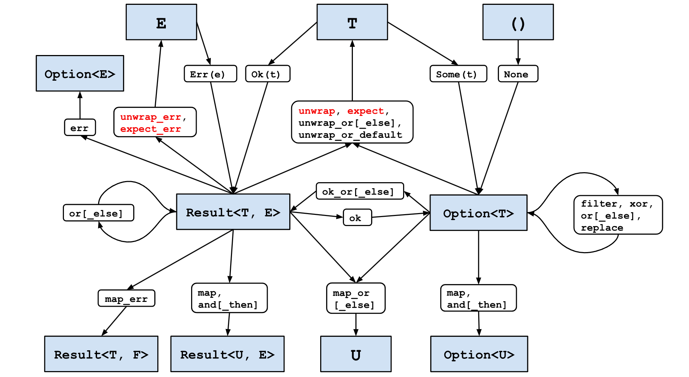

# Effective Rust by David Drysdale

## Chapter 1: Types

### Item 3 - Prefer Option and Result transforms over explicit match expressions


[Clickable diagram](https://oreil.ly/effective_rust_transforms)

### Item 4 - Prefer idiomatic Error types

- `thiserror` create is useful for automation of writing boilerplate code associated with various errors you got to handle. The generated with it's `derive` errors would not cause consumers of your code to also reference `thiserror` library.
- stack traces are not part of the idiomatic Rust error handling. This aligns with the Rust philosophy that it would rather correctly propagate and handle error than debug it. But if stack traces are needed one can opt-in and use crates like `anyhow` and `backtrace`. But stack traces are costly. `thiserror` and `anyhow` are created by the same author, btw.
- use `thiserror` for libs - errors preserve concrete detailed error information and don't impose extra libs on the users (handled with enums), `anyhow` for apps - to present the error details to the users/devs and to cope with various errors from different libraries (handled with dynamic dispatch)

### Item 6 - Embrace the newtype pattern

- Newtype pattern makes code more robust since it handles unit conversions correctly automatically and there is no ambiguity of redefining behavior for the same traits (abstract classes) by different crates (libs/modules) (the orphan rule). But it causes dev to write boilerplate code for implementing common traits like `#[derive(Debug, Copy, Clone, Eq, PartialEq, Ord, PartialOrd)]` plus `impl fmt::Display`.
- The mitigation of the orphan rule is is a common problem for serialization libs like `serde`. These libs provide some convenience mechanism to handle it.

### Item 7 - Use builders for complex types

- Newtype pattern also causes dev to write boilerplate builder code. There are two conventions:
  - chain-calls to fill in the fields and consume the builder in the last build() call
  - use modifiable builder variable and reply on clone in one or several the build() calls
- It is possible to reduce the boilerplate code by using `derive_builder` crate, but then your lib is adding a dependency on this crate. This seems a type of library that is quite optional. It's like using a Mocks lib in C#.

### Item 8 - Familiarize yourself with reference and pointer types

- Both `&Point` and `Box<Point>` are pointers that occupy 8 bytes of space on a 64-bit machine.
- Both can be used in a function that expects a reference to a Point `fn shot(pt: &Point)`. This is achieved by the `Deref` trait implemented for `Box<T>`.
- But the memory for the `Point` in `&Point` is allocated on the stack and it's lifetime is bound to the block that defines it.
- And the memory for the `Point` in `Box<Point>` is allocated on the heap, meaning it would outlive the current block and it would need to be de-allocated elsewhere.

- `AsRef` and `AsMut` allow conversions to a specific type of a reference. For String, for example, `&my_string` would implicitly coerce the type to `&str`. But one can use `AsRef<u8>`, `AsRef<OsStr>`, `AsRef<Path>`, `AsRef<str>`.
- The call would look like `let path = AsRef::<Path>::as_ref(&test);` or shorter `let path: &Path = test.as_ref();`

- `&T` and `Box<T>` don not store information what type they are pointing to, this is ephemeral info known only the the compiler
- Slices `&[T]` and Trait Objects `&dyn T` do store additional type information and thus are called the fat pointers.
- Slices store the length of the collection (+8 bytes on 64-bit machine). Note that slice notation uses include start, exclusive end. So `[2..4]` would have 2 elements `[2]` and `[3]`.
- Slices can't be instantiated directly, but can be casted from either static collection `array` where number of elements known at compile time, or dynamic collection `vector` where lib allocates and deallocates memory based on usage.
- Trait Objects additionally store the pointer to the `vtable` that contains method implementations for the said trait

- `dyn` in signature means dynamic dispatch, meaning that we don't know on runtime what type would it be

- `Borrow<T>` can be used to generalize functions that could work either on references or with moved variables (READ)
- `ToOwned` can be used to generalize functions that could work either on references or with moved variables that become locally owned items (WRITE)
- `Cow` is optimization that holds either borrowed or owned data, it is designed for cases when most of the time you just read the data, but occasionally need to write it (READ-WRITE)

- Smart pointers can look overwhelming `Rc<RefCell<Vec<T>>>`, but they aim to give the right fine-grained pointed semantic
- `Box<T>` - single owner, like `unique_ptr`
- `Rc<T>` - multiple owners, like `shared_ptr` - can leak memory on circular dependencies, but allow you to have self-referencing data structures in the first place. Usually it's used together with `RefCell`, unless you want shared ownership of unmutable data to avoid duplicating large data structure (`Box` would be enough) but reuse it in several places. E.g. in a graph structure.
- `Weak<T>` - do not assume ownership to break blocked drops in cyclic data structures, like `weak_ptr`, don't prevent an underlying item to be dropped. One can declare in a tree structure root as weak pointer and children as strong ones. Then as long as the program has a code path that owns the root pointer the whole structure is in memory. But it is still possible to delete children.
- `RefCell<T>` - allow to modify the owned item. With `Rc<T>` that would only be possible if nobody else is able to modify it, like if there is only one user that borrows it.
  - this type allows to violate the borrow checker and move the single ownership check from the compile time to the runtime. Meaning you can modify stuff even with `&self` non-mutable reference. This is called interior mutability in Rust lingo. This is achieved by storing the current number of borrows for the owned item.
  - on API side the user would need to either use `try_borrow` and handle `Result` or assume the borrow would work with `borrow` and be ok that a `panic` would happen if the assumption wrong
- `Cell<T>` is optimization that relies on `Copy<T>` to produce a bit-by-bit valid copy of `T` that is copied back and forth by it's get and set methods. So instead modifying an existing item you always recreate a new one, like `prototype` in JavaScript

- All of the above mentioned smart pointers are for a single thread use only, they can't handle simultaneous access from multiple threads
- `Arc<T>` is multithreaded version of `Rc<T>` that use atomic counters internally, but similarly to `Rc<T>` it doesn't permit internal mutability (compile time check that only one code path can mutate the item)
- `Mutex` ensures that only one thread can mutate the item, similar to `RefCell` it doesn't implement any pointer traits but ha a method that returns `MutexGuard` that does implement them
- `RwLock` is optimization that assumes there could be many readers but only a few writers, makes it similar to `Cow` somehow

### Item 9 - Consider using iterator transforms instead of explicit loops

- In Rust one would see something like `filter(|x| *x % 2 == 0)`. So the `*x` part is necessary visual noise because of the borrowing rules.
- Every collection can be moved into a consuming iterator via `into_iter` that is called automatically in `for( item in collection )` statements. After iterating through the collection that collection is gone. It may be not evident unless the iterated thing can't be copied. If `T` implements `Copy` you may not see that behavior since you would be working on the bitwise items copy.
- Since it is not usually desirable users need to operate not on the items themselves (that would be moved), but on the references to them. And use not `collection.into_iter()` but `(&collection).into_iter()` instead or more succinctly the `collection.iter()` method.
- As a side effect now moved would be not the items but references. And this is ok, but the signatures would need to dereference the items via `*x` syntax.
- `iter` and `iter_mut` methods are the default way to start iterator transformation, C# LINQ analog.

- `flatten` flattens iterator that contains iterators. It it not that common operation for a general type of an iterator though. But actually both `Option` and `Result` impalement iterators that return the item if it exists or nothing when there is nothing or an error. So flatten can be used to filter only successful values.

- aggregating a collection happens through either `reduce(|a, b| a + b)`, `fold(0, |acc, &x| acc + x)` or `scan(0, |state, &x| { *state += x; Some(*state) })`. Reduce uses first element as accumulator, fold uses user specified element, scan can be iterated to get access to the intermediate state of the accumulator.

- iterator transformations likely would produce a faster code compared to traditional for loops since complier can ensure that there is no `[i]` out of bounds exception, but also there are smarts that can optimize away these checks for the for loops as well

- iterator is converted back into a collection via `collect()` call. Collection type must be specified in order for compiler to find needed `FromIterator` trait. E.g. `: Vec<i32>` or `: HashSet<i32>`.
- `collect` can also be used to convert a vector of results into a result that is holding a vector if everything worked fine, that allows to use `?` operator instead of calling panic:

```rs
let result = Vec<u8> = input
  .into_iter()
  .map(|v| <u8>::try_from(v))
  .collect::<Result<Vec<_>,<_>>>()?;
```

## Chapter 2: Traits

### Item 10 - Familiarize yourself with standard traits

- Rust uses traits as generic-based interfaces. There are lots of very basic ones that are similar to copy-constructors, destructors, equality and assignment operators. For these traits the implementation details are boilerplate and Rust provides standard macros. Use the `#[derive(Clone, Copy, Debug, PartialEq, Eq, PartialPrd, Ord, Hash)]` macros when needed.
  - `Clone` runs user-defined code to create value, similar to explicit copy-constructor
  - `Copy` provides bit-by-bit equal value, it is a marker trait for Plain-Old-Data that just inherits `Clone` but actually doesn't call it and the complier is forced to use copy semantic instead of move semantic
  - `Default` creates a usable default value, similar to an explicit default constructor, can be used to fill in long structs with `..Default::default()`, can be used in [builders](#item-7---use-builders-for-complex-types)
  - `Eq` and `PartialEq` allow to compare items, similar to `operator==`, implemented as recursive filed-by-field comparison, `Eq` is a marker trait that assumes reflexivity meaning that that x==x is always true, distinction is important for a `NaN` float type
  - `Ord` and `PartialOrd` allow to compare and order items, implemented as recursive filed-by-field comparison, so the field order matters. `Ord` requires `Eq`, but sometimes `PartialOrd` does make sense - try ordering subsets {1,2} {1,2,4} {1,3} {2,4}
  - `Hash` produces stable hash, needs to provide same have for `Eq` items
  - `Debug` shows item to programmers `{:?}`, similar to `operator<<`, automatically derived, Rust implementation may change between releases, useful to have it by default unless a type contains sensitive information, use `#![warn(missing_debug_implementations)]` lint
  - `Display` shows item to users `{}`, similar to `operator<<`, got be be implemented, developer can enforce stable convention for parsable or localized output

### Item 11 - Implement the Drop trait for RAII patterns

- `drop` doesn't have any return value. So if freeing up some resource may fail a common practice would be to add `release` method that returns `Result`.

### Item 12 - Understand the trade-offs between generics and trait objects

- Generics (trait bounds) are similar to C++ templates with types enforced in runtime. E.g. `where T: Draw` or `<T: Draw>` or `draw: &impl Draw`, although the last one prohibits for the caller to specify the needed override `on_screen::<Circle>(&c)`. Internally compiler produces type-specific code that knows how to work with that specific data that implements the trait bounds. Operations happen on stack and CPU cache is used.
- Trait objects `&dyn Draw` are fat pointers that may reference the data on the heap. They point to the data and to the vtable with the trait methods. Compiler don't write data-specific code. Instead it uses indirection to call the corresponding methods in the runtime. Operations may happen on heap, CPU cache would likely be used only in the case of collections.
- Do not assume that trait objects are significantly slower without a proof of a measured bottleneck
- Generics allow to specify **multiple traits** and thus allow to define conditional behavior for types that implement multiple interfaces. Doing the same thing for trait objects is possible but cumbersome `trait DebugDraw: Debug + Draw {}` and `impl<T: Debug + Draw> DebugDraw for T {}`. Combinations of trait would kill maintainability of this approach.

- This notation is not analog to object oriented inheritance `trait Shape: Draw`. In OOP that means that `Shape-is-a-Draw`. In Rust that notations means `Shape additionally implements Draw`.
- This is implemented by combining several `vtables` from different bounds that a trait implements.
- As a consequence in Rust till 1.86 (April 2025) there was no way to upcast `(BaseDraw) ChildShape` - internal vtables were not composed in a way to support this. And that violated the OOP Liskov substitution principle - be able to replace objects of superclass with objection of subclass.
- But since `1.86` it is possible to do `fn upcast(x: &dyn Sub) -> &dyn Super { x // implicit coercion }`. So a trait object argument `&dyn Shape` can be passed to another function that accepts `&dyn Draw`. Yay!

- Trait objects can't implement `Clone` due to the object safety rules. Trait objects are passed as fat pointer arguments. But clone creates a copy of the object on stack. Rust generally doesn't know at runtime how much space an object would occupy on stack and disallows it. `Box<Self>` theoretically should be safe to return, but as the time of writing the book Rust was 1.7 and [it was not possible](https://github.com/rust-lang/rust/issues/47649).
- In case compiler knows the type size via `Sized` marker trait this restriction is alleviated. But methods that return Self still can't be called.
- Overall Rust tends to prefer generics, and one can say that trait objects deliberately erase their type.
- Dynamically loaded code (via `dlopen`) doesn't have source code and thus generics can't be generated, only trait objects can be used

## Chapter 3: Concepts

### Item 14 - Understand lifetimes

- Lifetimes are fundamentally related to the stack
- Stack holds state relevant to the currently executed function
- Compiler associates **every** referece `&` type with a lifetime `'` which sometimes can be hidden (this is called lifetime elision), but it is always `&'lifetime variable` internally. Data structures do not use elision rules and need to be annotated explicitly.
- Lifetime is the period when the value stays at the same address on the stack, meaning `&` references to it would be valid - from value creation to drop or move
- Rust moves values on the stack, from stack to heap and from heap to stack
- For unnamed variables the lifetime behaves as if the temp value is dropped when it is not needed, so `let x = f((a+b)*2);` is expanded to something like:

  ```rs
  let x = {
    let sum = a + b;
    {
      let mul = sum * 2;
      f(mul)
    } // mul drop
  }; // sum drop
  ```

- This is why the following code doesn't compile. Temp variable that holds the function argument is dropped. To fix it this variable needs to be explicitly pinned.

  ```rs
  let var: &Item = return_reference(&mut Item{ value: 42});
  // can't use var.value - referenced Item is dropped just after the function call and before var asignment
  ```

- `static` is more strong than `const`. Static means it is pinned in memory. The constants may be replicated by the complier - so each would have a lifetime of a program but may have a different address. Also `const` values may have a drop desructor - so the pin property is lost for thouse.
- Heap-allocated but never freed variables satisfy the `'static` lifetime constraint. But `Box<T>` is not enough - it can be dropped. To mitigate that use `Box::leak` that returns `&'static mut`.
- `static` annotation would have a similar intent to a singleton in OOP
- Unless leaked every heap allocated variable has an owner. The `T` lives on the heap but there is a `Box<T>` variable on the stack that owns it.
- The chain of ownership ends in either - a stack variable or a static global variable.

- Since data structures don't use lifetime elision rules they got to be annotated explicitly and that annotation is inctios - all data structures that reference it need to be annotated as well. Usually fields of a data structure has the same lifetime as the structure itself. But there can be exceptions - like the structure that holds common substring from two different strings. The fileds of LargestCommonSubstring would reference left and right variables and can be used only when references to them are still valid (they can't be moved or dropped).

  ```rs
  pub fn find_largest_common_substring<'a, 'b>(left: &'a str, right: &'b str) -> Option<LargestCommonSubstring<'a, 'b>>{ ... }
  ```

- Aligning lifetimes can be hard. Thus **prefer data structures that own their data**. If not possible use smart pointers `Rc<T>` etc. Only highly optimized code like JSON/HTML parsers should care about pinning data in memory for efficency.

### Item 15 - Understand the borrow checker

- References are always marked with `&`. If you see in code `f(value)` it means that `f` receives ownership of the `value` or it's copy if it implements `Copy` trait.
- The borrow cheker changes the ways how you design data structures.
- Onwer of a value can: create it, read/write, drop it and re-assign ownership (move it - create the item in new stack location and drop it on the old stack location)
- Mutable reference can be used to read/write a value
- Reference can be used to read a value

#### Useful techniques to fight the borrow checker

- `Lifetime extension` - name a temporal variable to pin it onto stack so that a derivative variable would be able to use it.
- `Lifetime reduction` - add extra blocks that would ensure a variable is dropped when needed, less common since Rust would drop unused variables not at the end of a block but when they are not mentioned in the code anymore. Also it is a sign that an additional method is needed here.
- `Expand all temporal variables` of a terse expression:

```rs
// we are trying to call function that expects Option<&Item> with this guy
let x0: Option<Rc<RefCell<Item>>> = Some(Rc::new(RefCell::new(Item {value: 42})));

// instead of check_item(x.as_ref().map(|r| r.borrow().deref()));
let x1: Option<&Rc<RefCell<Item>>> = x0.as_ref();
let x2: Option<std::cell::Ref<Item>> = x1.map(|r| r.borrow());
let x3: Option<&Item> = x2.map(|r| r.deref()); // returns reference to data owned by the current function

// once the issue is understood the code becomes:
let x3 = match x2 {
  None => check_item(None),
  Some(r) => {
    let x4: &Item = r.deref();
    check_item(Some(x4));
  }
}

// or more tersly as, but that may loose code maintainability, x4 was showing why this maneuver was needed
let x3 = match x.as_ref().map(|r1| r1.borrow()) {
  None => check_item(None),
  Some(r2) => check_item(Some(r2.deref())),
}
```

- Design data structures so they would `own all of their data` and don't use references. Not possible if you need to reference the same data several times: like different kind of lookup or cyclic graphs in the data.
- If you need to store several ways to do lookups on the same data that means you got to have several data structures and only one of them can own the data. Small ammounts of data can be just `cloned`. But this approach breaks for mutabale data.
- Making an indirect lookup by indexes is re-introducing us to the world of dangling pointers, something that Rust should protect us against. It's better to use `Rc` and `RefCell`.

```rs
#[derive(Default)]
pub struct GuestRegister {
  by_arrival: Vec<Rc<RefCell<Guest>>>.
  by_name: BTreeMap<String, Rc<RefCell<Guest>>>,
}

impl GuestRegister {
  pub fn register_guest_arrival(&mut self, guest: Guest) {
    let name = guest.name.clone(); // we own name String now
    let guest = Rc::new(RefCell::new(guest)); // temp variable created here
    self.by_arrival.push(guest.clone()); // clone is needed since in next line the guest temp var is moved
    self.by_name.insert(name, guest); // by_name owns both key and value, but value is Rc that allows to update it's underlying data via RefCell that allows runtime mutability - we can update guest's address if needed
  }

  pub fn deregister_nth(&mut self, index: usize) -> Result<(), GuestRegisterError> {
    if index >= self.by_arrival.len() {
      return Err(GuestRegisterError::new("out of bounds")); // instead of panic on the next line
    }

    let guest: Rc<RefCell<Guest>> = self.by_arrival.remove(index); // move the value, no panic is possible
    self.by_name.remove(&guest.borrow().name); // & is used the last, it takes the effect after all of the following: we borrow guest variable in runtime via Rc, then get name: String field, only then we get a reference & to it and then are doing lookup via the &str reference in a BTreeMap that stores String, the String and BTreeMap API should allow to do that kind of a thing
    Ok(())
  }
}
```

- And here is example how to use smart pointers in a graph data structure.

```rs
struct TreeRoot {
  id: TreeRootId,
  branches: Vec<Rc<RefCell<Branch>>>, // Rc<RefCell> is similar to shared_ptr
                                      // we reference these branches elsewhere
}
struct Branch {
  id: BranchId,
  leaves: Vec<Rc<RefCell<Leaf>>>,
  parent: Option<Week<RefCell<TreeRoot>>>,  // Option - branch can become orphaned
                                            // Week - branch must not prevent drop of parent (cyclic ref)
                                            // RefCell - we have code that modifies TreeRoot from a branch method
}
struct Leaf {
  id: LeafId,
  parent: Option<Week<RefCell<Branch>>>,
}

impl Branch {
  fn add_leaf(branch: Rc<RefCell<Branch>>, mut leaf: Leaf) {      // we get moved leaf and complete ownership of it
    leaf.parent = Some(Rc::downgrade(&branch));                   // make it a weak pointer
    branch.borrow_mut().leaves.push(Rc::new(RefCell::new(leaf)))  // create RefCell that gets leaf ownership
  }
  fn location(&self) -> String {
    match &self.parent {
      None => format!("<orphan>.{}", self.id.0),
      Some(parent) => {
        let treeRoot = parent.upgrade().expect("some other thread removed parent");
        format!("{}.{}", treeRoot.borrow().id.0, self.id.0)
      }
    }
  }
}
```

- if you can't find the pointer semantic you want, you can use `unsafe` code that use raw pointers
- self-referencing data structures are particularly nasty to deal with, if possible avoid them or find crates that implemented them for you like `ouroborus` that add `'this` lifetime via a macro. In async code the self-referencing is inherent and is solved via `Pin`.

### Item 16 - Avoit writing unsafe code

- `unsafe` means that programmer now is responsible to maintain Rust safety guarantees, not compiler
- Most of the unsafe code was already written and well-tested. Here are the crates:
  - `once_cell` - lazy singletons
  - `rand` - randomization that is using low-level primitives available
  - `byteorder` - convert numbers to and from bytes
  - `cxx` - interop with C++
- If you have to write unsafe code, wrap it in a module - it would make it easier to maintain
- Add [safety comments](https://std-dev-guide.rust-lang.org/policy/safety-comments.html), enable clippy for reminder
- Add more tests than usual
- Run 'Miri' to detect issues that Rust compiler can't capture

### Item 17 - We ware of shared-state parallelism

- [Fearless-Concurrency in Rust](https://blog.rust-lang.org/2015/04/10/Fearless-Concurrency/) - language-native ways to use mutithreading safely
- Mutex poisoning is a quite a rare thing, so it's ok to use `.unwrap()` on the mutex here and let it panic if poisoning happened
- Mutex moves borrow checking to runtime, so it another example of interior mutability
- To ensure that each thread doesn't outlive the data it is using, wrap that data in `Arc` and clone it for each of the threads. This way the main thread doesn't need to wait for either of the spawned threads and copy of arcs can be moved into the thread function.
- `Send` (ok to transfer between threads) and `Sync` (ok to use from mutiple threads) are both marker traits - they don't have any methods, but compiler treats them in a special way. Both traits are implemented and auto-inherited unless the type is annotated that it doesn't now have these traits.
  - `Sync` can be seen as `&T` is ok to transfer between threads.
  - `Sync` doesn't care about `&mut T` references since they gurantee that there is only one user. It only is applicable to `&T` since these references may have iterior mutability - meaning satisfying the borrow checker at runtime.
- `Rc<T>` does not have `Send` since it does not count usages in a thread-safe way. Use `Arc` instead.
- `Cell<T>` and `RefCell<T>` do not have `Sync` since they don't implement interior mutability in a thread-safe way. Use `Mutex` (exclusive access) and `RwLock` (several readers, one writer) instead.
- Raw pointers don't have either `Send` or `Sync`. Use unsafe code and satisfy borrow checker manually, pal.

- Deadlocks are still possible when two threads access two mutex-protected data structures that have two fields and the fields access is AB in first thread but BA in second thread. The books calls this issue the `lock inversion`. To solve either:
  - reduce the scope of locks with extra `{}` so that at the same time only one resource is locked, not multiple. Smaller focused methods help a lot. But this may lead to data consistency problem - when modification of every piece of the data is correct but data taken together doesn't make sense, like there is a game with a player that is absent from the players list.
  - lock both data structures with the same lock on a higher level. This is the right way to do it.

- Another way to solve this is by using `channels` that share memory by communicating.

- Another useful tips to handle deadlocking:
  - don't return MutexGuard from functions
  - don't use closures with locks held
  - add deadlock detection tools: `no_deadlocks`, `parking_lot::deadlock`, `ThreadSanitizer`
  - prefer code that is so simple it is obviously not wrong

### Item 18 - Don't panic

- `panic` by default would terminate the thread that issued it, there is an option that looks like an exception handler `catch_unwind`, but it is really not it - that's overridable behaviour, and Rust don't rely on exceptions. `catch_unwind` is really needed for FFI interop code so that panics don't propogate to the non-Rust code.
- compiler option in `cargo.toml` decides if panic terminates the thread or the process, and `WebAssembly` always aborts disregarding any settings
- also exceptions can leave data structures in an inconsistent state, this is so hard to achieve in C++ that [Google bans exceptions in C++ code](https://google.github.io/styleguide/cppguide.html#Exceptions), the complexity goes even higher for templated code

- good rule of thumb is to allow panic/unwrap/expect if you have control of `main`
- for libraries it is ok panic/unwrap/expect if the operation has very small changes of failure and you do not want your users to litter their code with unwraps
- similarly library may panic if it sees a datastructure that became corrupted
- libraries should document all their panic code paths - this is part of the library's contract - e.g. `String::from_utf8` and `String::from_utf8_unchecked`

- all of the following can result in a panic - `panic/unwrap/expect/unreachable/unwrap_err/expect_err`, but also `slice[index]` and `x/y` may panic
- for enforcing `let's don't panic` rule a `no_panic` crate can be used for the build system

### Item 20 - Avoid the temptation to over-optimize

- Just allows to create zero-copy non-allocating algs safely, but this doesn't mean that every your alg implementation needs to be zero-copy non-allocting. They come with at a cost of usability and maintainability.
- Lifetimes start to matter a lot here. If a server processes incoming stream of bits, their lifetime is bound to the incomming messages. But to store and return them later on the server needs to copy these bits somewhere.
- And then there is a question of memory fragmentation. The usage of the incoming and stored data patterns is different. Incoming data from source is not aware of other data from other sources. But the server has to store relavant data organized by fast access and by storing only what is needed close togehter in memory.

- Programmers want to get efficient because Rust forces every copy to be explicit as in `to_vec()` or `.clone()` or by making an explicit allocation via `Box::new()`. C++ on the other hand did an implicit copy via copy-constructors and assignment operators.
  - Exception here are the cypes that implement `Copy` trait, but if this trait is implemented it means that the copies are cheap (like they can just be a copy of a register)
- Making an operation visible and explicit shouldn't be justify optimizing it away on it's own. It comes with a cost of usability and maintainability.
- A good rule of thumb strategy is optimize for `usability` first and address `performance` concerns only when the permormance *really imposees a problem* with some benchmarks clearly showing it.

- So be cool about using `.clone()` when needed and use `Arc` when you want pass data between threads.
- Smart pointers are not the last resort, often they allow you to achive *simpler, more maintainable and more usable design*.
